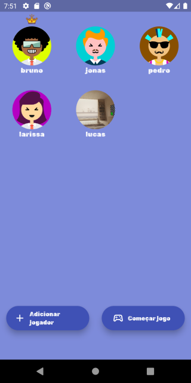
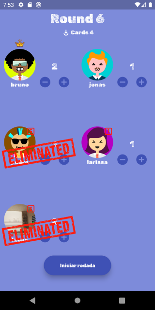
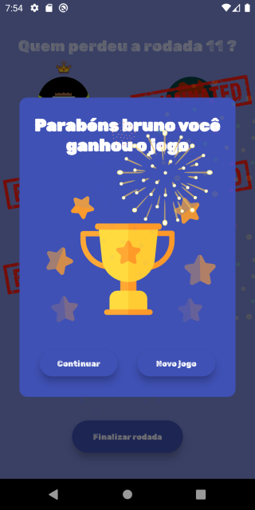

# fodinha_flutter

### App para gerenciar um jogo de baralho chamado Fodinha.
A criação desse aplicativo foi muito proveitosa para praticar o uso do gerenciador de estados globais com MobX, persistencia de dados com banco NoSQL (isarDB) e também compreender melhor o conceito arquitetura de software MVVM.

### Descrição do Projeto
Um aplicativo para gerenciar uma partida de Fodinha pelo celular. 
O aplicativo deve ser capaz de criar uma partida, adicionar até no máximo 10 jogadores, definir o número de rounds que cada jogador disse fazer seguindo as seguintes regras.

- O número de rounds que o jogador define não pode ser maior que o número de cartas.
- O número de cartas aumenta em 1 a cada round até 5 e reduz até 1 novamente.
- O número de rounds dos jogadores somados não pode ser igual ao número de cartas, pois sempre tem que haver ao menos 1 perdedor da rodada.
- Se o jogador perder 5x (vezes) está eliminado do jogo.
- O jogo acaba quando restar 1.


### Instalação
1. Clique no arquivo fodinha-flutter.apk
2. Pesquise por raw, atalho (ctrl + f), ou no canto superior direito verá um icone para baixar o arquivo, clique nele.
3. Mande esse arquivo para um dispositivo android e instale. "O aplicativo não tem credenciais, o dispositivo android irá acusar como possivel arquivo malicioso"

### Ou

### Instalação
1. Clone o repositório
```bash
$ git clone https://github.com/Brunonasccimentto/fodinha-flutter
```

2. Conecte um emulador ou dispositivo android via usb
3. Caso não tenha feito, ative a depuração via usb nas opções de desenvolvedor. 

4. Instale o apk
```bash
$ flutter install
```

### Como usar
- **Adicionar jogadores:** Toque no botão adicionar jogadores.
- **Definir foto ou avatar:** Para escolher um avatar toque na área colorida com as iniciais do jogador.
- **Novo Dealer:** Para definir um novo dealer (icone de moeda roxa) pressione um jogador não dealer.
- **Defina o número de rounds:** Para cada jogador defina o número de rounds pelos botões de - e +.
- **Defina o perdedor:** Para Selecionar o perdedor, toque nos jogadores que perderam o round.

### ScreenShots

#### Tela inicial


#### Tela de jogadores


#### Modal de avatares


#### Jogadores arrastáveis para excluir


#### Tela do jogo / Scoreboard




#### Histórico do jogador


#### Tela Fim de round


#### Modal do vencedor



